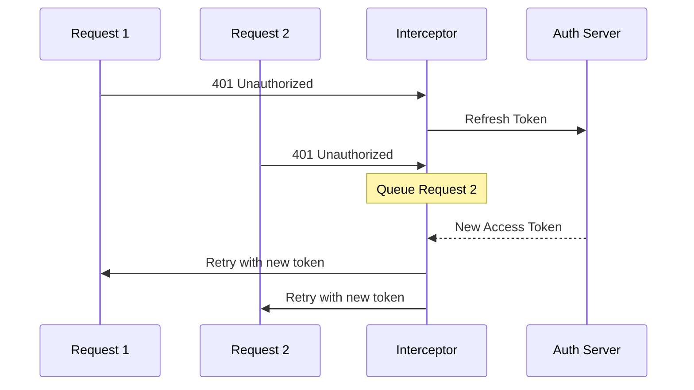

# Nafith Frontend Core Revamp

## Technical Deep Dive

<div class="abs-bl m-6 text-left text-sm opacity-60">
  Frontend Team
</div>

<div class="abs-br m-6 text-sm opacity-60">
  2026
</div>

<!--
This presentation covers the technical decisions, patterns, and implementation details of the frontend core revamp.
-->

---
transition: fade-out
---

# Agenda

<v-clicks>

1. Tech Stack Comparison
2. Architecture & Code Organization
3. Type Safety & Code Quality
4. State Management
5. UI Framework & Theming
6. Routing & Navigation
7. Internationalization (i18n)
8. API Layer & Error Handling
9. Performance Optimizations
10. Developer Experience

</v-clicks>

<!--
Each section covers a specific technical domain — the old approach, the new approach, and why the change was made.
-->

---
layout: section
---

# Tech Stack Comparison

Old vs New — side by side

---

# Tech Stack Comparison

<div class="overflow-auto">

| Area | Old (frontend-core) | New (frontend-core-revamp) |
| --- | --- | --- |
| **Framework** | Vue 3.2 (mixed JS/TS) | Vue 3.5 (full TypeScript, strict mode) |
| **Language** | JavaScript (some .ts files) | TypeScript throughout (`strict: true`) |
| **State Mgmt** | Vuex 4.1 | Pinia 3.0 |
| **UI Library** | PrimeVue 3.34 **+ Bootstrap 5.3** | Vuetify 3.9 (single library) |
| **CSS** | 59 SCSS files + Bootstrap RTL/LTR | Native Scoped SCSS + Vuetify theming |
| **Code Patterns** | Mixins + Options API + Composition API | Composition API + `<script setup>` only |
| **Linting** | ESLint 8 (legacy config) | ESLint 9 (flat config + strict TS rules) |

</div>

<!--
Here's the full side-by-side comparison. Notice the theme: consolidation and modernization. Two UI libraries became one. Three component styles became one. JavaScript became TypeScript. Monolithic became modular.
-->

---
layout: section
---

# Architecture & Code Organization

From flat folders to feature modules

---
layout: two-cols-header
---

# Architecture & Code Organization

::left::

### Old: Flat, Role-Based

```txt {*}{lines:false}
src/
├── components/        # 106 components
│   ├── form/
│   ├── layout/
│   ├── portal/        # Deep nesting
│   └── main/
├── views/             # Separate from components
├── services/          # Class-based APIs
├── store/             # Vuex modules
├── mixins/            # Shared logic
├── composition/       # Some composables
├── helpers/           # Utilities
└── assets/sass/       # 59 SCSS files
```

::right::

### New: Feature-Driven Modular

```txt {*}{lines:false}
src/
├── features/          # Self-contained modules
│   ├── auth/          # views + composables
│   ├── sanad_management/
│   ├── financial_details/
│   ├── employee_management/
│   └── ...
├── shared/            # Reusable across features
│   ├── ui/            # Base components
│   ├── composables/   # Shared hooks
│   ├── directives/    # Custom directives
│   ├── utils/         # Pure utilities
│   ├── constants/     # Type-safe constants
│   └── interfaces/    # TypeScript interfaces
├── services/api/      # Typed API layer
├── stores/            # Pinia stores
├── layouts/           # Public, Portal
├── config/            # Plugin config
└── locales/           # Feature-split i18n
```

---

# The Key Benefit

Each feature is **self-contained** — its views, components, composables, and utils live together.

Adding or removing a feature <span v-mark.underline.red>doesn't ripple through the entire codebase</span>.

<!--
This is the most important architectural change. Features are isolated modules. They can share from the shared layer, but they don't depend on each other. This makes the codebase navigable and maintainable.
-->

---
layout: section
---

# Type Safety & Code Quality

From runtime errors to compile-time guarantees

---

# Before: JavaScript + Optional TS

<div class="mt-4">

```javascript {all|2-3|all}{lines:true}
// Old: No type safety, runtime errors possible
static request(method, endpoint, data = null, configs = null) {
    return axios[method](endpoint, data, configs)
}
```

</div>

<div class="mt-6">

```javascript {all|3-4|6-7|all}{lines:true}
// Mixins with implicit "this" bindings
export default {
    computed: {
        ...mapGetters(["getUser", "isAuthenticated"]),
        isCompanyUser() {
            return this.getUser?.type === "COMPANY"
        }
    }
}
```

</div>

<v-click>

<div class="mt-4 p-3 bg-red-500 bg-opacity-10 border border-red-500 border-opacity-30 rounded-lg text-sm">

**Problems**: No autocomplete, no refactoring safety, bugs only discovered at runtime, implicit `this` bindings from mixins

</div>

</v-click>

<!--
Look at this code. The request method accepts literally anything. The mixin injects properties via mapGetters with no way for the IDE to know what "getUser" returns. Every refactoring was a prayer.
-->

---

# After: Strict TypeScript

````md magic-move {lines: true}
```typescript
// Step 1: Typed API service functions
export async function companyLogin(
  credentials: LoginCredentials
): Promise<AuthResponse> {
  return apiService.post<AuthResponse>(
    "/auth/company-login/",
    credentials
  );
}
```

```typescript
// Step 2: Composables with explicit typing
export function useAuth() {
  const authStore = useAuthStore();

  const isAuthenticated = computed<boolean>(
    () => authStore.isAuthenticated
  );

  return { isAuthenticated, companyLogin, logout };
}
```
````

<v-click>

<div class="mt-4 p-3 bg-green-500 bg-opacity-10 border border-green-500 border-opacity-30 rounded-lg text-sm">

**Result**: Full IntelliSense, safe refactoring, bugs caught at compile time, explicit contracts

</div>

</v-click>

---

# TypeScript Strict Mode Flags

We enforce the strictest possible TypeScript configuration:

<v-clicks>

- `noUnusedLocals` — No dead variables
- `noUnusedParameters` — No dead parameters
- `exactOptionalPropertyTypes` — Precise optional types
- `noUncheckedIndexedAccess` — Safe array/object access
- `useUnknownInCatchVariables` — Type-safe error handling
- <span v-mark.circle.red>`no-explicit-any`</span> enforced via ESLint — **Zero** `any` types allowed

</v-clicks>

<!--
This last one is particularly important. We have a zero-any policy. If you can't type it, you need to think harder about your data model.
-->

---
layout: section
---

# State Management

Vuex vs Pinia

---
layout: two-cols-header
---

# State Management: Vuex vs Pinia

::left::

### Before (Vuex — verbose)

```javascript {all|3-8|9-13|14-17|all}{lines:true}
// store/auth.js
export default {
  state: {
    accessToken: null,
    refreshToken: null,
    user: null
  },
  mutations: {
    setAccessToken(state, token) {
      state.accessToken = token
    },
    setRefreshToken(state, token) {
      state.refreshToken = token
    },
  },
  actions: {
    authenticate({ commit }, payload) {
      commit("setAccessToken", payload.access)
    },
  },
  getters: {
    isAuthenticated: s => !!s.accessToken,
  }
}
```

::right::

### After (Pinia — clean)

```typescript {all|3-5|7-10|12-14|all}{lines:true} 
// stores/auth.ts
export const useAuthStore = defineStore("auth", () => {
  const accessToken = ref<string | null>(null);
  const isAuthenticated =
    computed(() => !!accessToken.value);

  function setAuthData(data: AuthResponse) {
    accessToken.value = data.access;
    refreshToken.value = data.refresh;
  }

  function clearAuthData() {
    /* ... */
  }

  return {
    accessToken,
    isAuthenticated,
    setAuthData,
    clearAuthData,
  };
});
```

---

# Using the Store in Components

````md magic-move {lines: true} 
```javascript
// Old: Vuex — string-based dispatch, no types
computed: {
  ...mapGetters(["isAuthenticated", "getUser"])
}
this.$store.dispatch("authenticate", tokens)
```

```typescript
// New: Pinia — direct function calls, full IntelliSense
const { isAuthenticated } = storeToRefs(useAuthStore());
useAuthStore().setAuthData(tokens);
```
````


<v-clicks>

### Why Pinia Wins

- No mutations layer — direct state updates
- Full TypeScript support with auto-complete
- No string-based dispatching — just function calls
- Devtools integration built-in
- Smaller bundle size
- Composition API native

</v-clicks>


<!--
The difference is dramatic. Pinia eliminated an entire layer of abstraction. No more mutations, no more string dispatching, no more mapGetters. Just functions with types.
-->

---
layout: section
---

# UI Framework & Theming

Two libraries to one

---

# Old: Two Libraries, Double the Problems

<div class="grid grid-cols-2 gap-8 mt-4">

<div>

### PrimeVue 3.34
<v-clicks at="1">

- Interactive components (tables, dialogs, forms)
- Its own CSS reset
- Its own spacing system

</v-clicks>
</div>

<div>

### Bootstrap 5.3
<v-clicks at="1">

- Layout grid and utilities
- Competing CSS reset
- Different spacing/typography

</v-clicks>
</div>

</div>

<v-click>

<div class="mt-6 p-4 bg-red-500 bg-opacity-10 border border-red-500 border-opacity-30 rounded-lg">

**The result**: Two RTL stylesheets (`bootstrap.rtl.css` + PrimeVue RTL overrides), inconsistent design, extra CSS shipped to users

</div>

</v-click>

---

# New: One Unified Library — Vuetify 3.9

<v-clicks>

- **Material Design 3** system — consistent design language
- Built-in **grid system** (no Bootstrap needed)
- Built-in **RTL support** (automatic with locale)
- Built-in **theming** — 40+ custom color tokens (light + dark themes)
- **Tree-shakeable** — Only used components are bundled
- **Accessibility** — WCAG compliance built into every component

</v-clicks>

<v-click>

### Theme Configuration — Single Source of Truth

```typescript {*}{lines:true}
// config/vuetify.ts
const lightTheme = {
  colors: {
    primary: "#2a7050",
    secondary: "#f5f5f5",
    error: "#B00020",
    success: "#4CAF50",
    // 40+ tokens...
  },
};
```

</v-click>

<!--
One library. One design system. One source of truth for colors. No more fighting between frameworks.
-->

---
layout: section
---

# Routing & Navigation

Monolith to modular

---
layout: two-cols-header
---

# Routing: Monolith vs Modular

::left::

### Before: 1,800+ Line File

```javascript {*}{lines:false}
// router/index.js — everything in one file
const routes = [
  { path: "/", component: Home },
  { path: "/accounts/login/individual/",
    ... },
  { path: "/portal/sanad-create/",
    children: [ /* 6 nested steps */ ]
  },
  { path: "/portal/sanads/", ... },
  { path: "/portal/company/employees/",
    ... },
  // ... 80+ more routes
]
```

::right::

### After: Feature-Split Modules

```typescript {*}{lines:false}
// router/index.ts — clean orchestration
import publicRoutes
  from "./public";
import sanadManagementRoutes
  from "./sanadManagement";
import financialDetailsRoutes
  from "./financialDetails";
import employeeManagementRoutes
  from "./employeeManagement";
import callbackRoutes
  from "./callback";
import sanadApprovalRoutes
  from "./sanadApproval";
```

---

# Route Module Example

```typescript {all|2-3|4|5|all}{lines:true}
// router/sanadManagement.ts — each module owns its routes
export default [
  {
    path: "sanads",
    name: "sanadList",
    component: () => import("@/features/sanad_management/views/SanadList.vue"),
    meta: {
      i18nPages: ["sanadManagement"],
      requiresPermission: ["view_sanads"],
    },
  },
  // ...
];
```

<v-clicks>

- Each feature **owns its routes**
- Adding a feature = adding **one import**
- Route guards leverage **typed metadata** (`requiresPermission: string[]`)
- Dynamic **i18n loading** per route via `meta.i18nPages`

</v-clicks>

<!--
Each feature module defines its own routes. The main router file just orchestrates imports. Adding a new feature means adding one import line.
-->

---
layout: section
---

# Internationalization

Eager loading vs lazy loading

---

# i18n: Eager vs Lazy

<div class="grid grid-cols-2 gap-8">
<div>

### Before: Load Everything

```javascript {*}{lines:true}
// All translations loaded at startup
import ar from "@/translations/ar.json";
import en from "@/translations/en.json";

const i18n = createI18n({
  messages: { ar, en },
  // Entire payload in memory
});
```

</div>
<div>

### After: Lazy Per-Feature

```typescript {all|3|6-8|all}{lines:true}
// Only global translations at startup
// Route metadata triggers lazy loading
{ path: "sanads", meta: { i18nPages: ["sanadManagement"] } }

// Navigation guard loads dynamically
router.beforeEach(async (to) => {
  if (to.meta.i18nPages) {
    await loadAndSetPageMessages(to.meta.i18nPages);
  }
});
```

</div>
</div>

---

# Translation File Structure

```txt {*}{lines:false}
locales/
├── en.json                # Global strings only
├── ar.json
├── auth/en.json           # Loaded only on auth pages
├── sanadManagement/       # Loaded only on sanad pages
├── financialDetails/      # Loaded only on financial pages
└── ...                    # 15+ feature-specific locale folders
```

<v-clicks>

- **Faster initial load** — only global strings shipped upfront
- **Smaller memory footprint** — unused translations never loaded
- **Easier maintenance** — each feature manages its own translations
- **Scalable** — adding a new language = new JSON files per feature

</v-clicks>

<!--
This is huge for performance. Instead of loading translations for 15+ features on every page load, we only load what the current page needs.
-->

---
layout: section
---

# API Layer & Error Handling

Class-based to functional, typed, and resilient

---
layout: two-cols-header
---

# API Layer: Before & After

::left::

### Before: Loosely Typed

```javascript {*}{lines:true}
// services/BaseService.js
class BaseService {
  static endpoint(path) {
    return `${this.appEndpoint}${path}`;
  }

  static request(
    method,
    endpoint,
    data = null,
    configs = null
  ) {
    return axios[method](
      endpoint,
      data,
      configs
    );
  }
}
// No typed responses
// No structured error handling
```

::right::

### After: Typed & Structured

```typescript {all|1-5|7-11|13-17|all}{lines:true}
// services/api/apiService.ts
const apiService = axios.create({
  baseURL: `${import.meta.env.VITE_API_BASE_URL}/api/backend/`,
  timeout: 10_000,
  withCredentials: true,
});

// Custom error class
class ApiError extends Error {
  status?: number;
  code?: string;
  errors?: Record<string, string[]>;
}

// Typed service functions
export async function getSanads(
  params: SanadFilters
): Promise<PaginatedResponse<Sanad>> {
  return apiService.get("/sanads/", { params });
}
```

---

# Token Refresh with Request Queuing



Concurrent requests during token refresh are **queued and replayed** automatically — prevents race conditions and duplicate refresh calls.

<!--
This diagram shows our token refresh mechanism. When a request fails with 401, we start refreshing the token. Any other requests that fail during the refresh are queued and automatically retried with the new token.
-->

---
layout: section
---

# Performance Optimizations

Bundle splitting, lazy loading, and removed overhead

---

# Manual Chunk Splitting

```typescript {all|2|3|4|5|6|7|all}{lines:true}
// vite.config.ts — Optimized bundle strategy
manualChunks: {
  vuetify: ["vuetify"],
  charts: ["chart.js"],
  icons: ["@mdi/font"],
  "vue-ecosystem": ["vue", "vue-router", "pinia"],
  validation: ["vee-validate", "yup", "@vee-validate/rules"],
  utils: ["@vueuse/core"],
  locales: ["vue-i18n"],
}
```

<v-clicks>

- **Vendor caching** — Library chunks cached independently
- **Parallel loading** — Browser loads multiple smaller chunks concurrently
- **Bundle analysis** — `npm run build:analyze` generates visual report
- **Lazy route loading** — Every route component loaded on demand
- **Lazy i18n** — Translation files loaded per feature on navigation

</v-clicks>


---
layout: fact
---

# ~4.5MB
<div class="text-2xl mt-4 opacity-80">of unnecessary code removed from every page load</div>
<div class="grid grid-cols-2 gap-4 mt-6">
  <div>
    Old
    
  </div>
  <div>
  New
    
  </div>
</div>

---
layout: fact
---

<div class="text-2xl mt-4 opacity-80">The performance gains are obvious</div>
<div class="grid grid-cols-2 gap-4 mt-6">
  <div>
    Old
    
  </div>
  <div>
  New
    
  </div>
</div>

---
layout: section
---

# Developer Experience

The daily impact on the team

---

# Developer Experience

| Aspect | Old | New |
| --- | --- | --- |
| **IDE Support** | Limited (JS, no strict types) | Full IntelliSense, auto-imports (TS) |
| **Refactoring** | Risky (no compiler checks) | Safe (TypeScript catches breaking changes) |
| **Component API** | Mixed (Options + Composition + Mixins) | Single standard (`<script setup>`) |
| **Finding Code** | Search through flat folders | Navigate by feature module |
| **Adding a Feature** | Touch 5+ directories | Create one feature folder |
| **State Management** | `this.$store.dispatch("string")` | `useStore().method()` with types |
| **Error Discovery** | Runtime (in browser) | Compile time (in editor) |

<!--
This table summarizes what the daily developer experience looks like. The new codebase is simply more pleasant to work in. IntelliSense works everywhere, refactoring is safe, and code organization is intuitive.
-->

---
layout: section
---

# Technical Recap

---

# Key Technical Decisions

<v-clicks>

- **TypeScript `strict: true`** + zero `any` policy via ESLint — compile-time safety everywhere
- **Composition API + `<script setup>` only** — single component paradigm, no mixins
- **Pinia over Vuex** — eliminated mutations layer and string-based dispatch
- **Vuetify as sole UI library** — removed Bootstrap, unified theming with 40+ design tokens
- **Feature-driven modules** — self-contained folders with co-located views, composables, and utils
- **Modular routing** — feature-split route files with typed `meta` for guards and i18n
- **Lazy i18n** — per-route translation loading via `router.beforeEach` + `meta.i18nPages`
- **Vite manual chunks** — vendor splitting for independent cache invalidation
- **Typed API layer** — `ApiError` class + interceptor-based token refresh with request queuing

</v-clicks>

---
layout: center
class: text-center
---

# Thank You

Questions?

<div class="mt-8 text-lg opacity-70">

Nafith Frontend Team

</div>

<!--
Thank you for listening. Happy to dive deeper into any of the technical decisions.
-->
