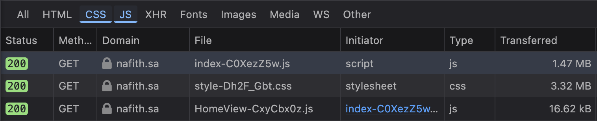
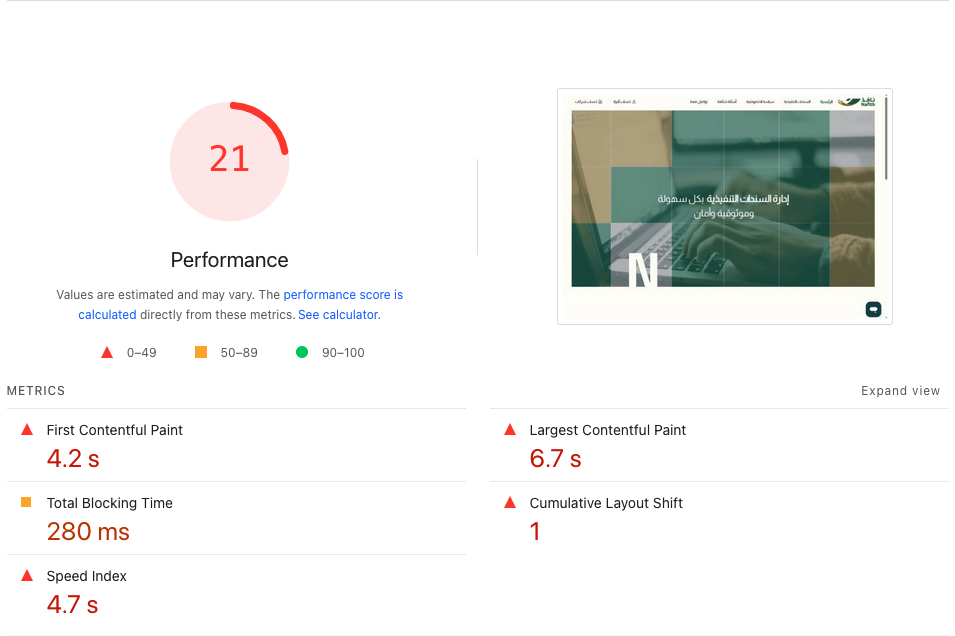
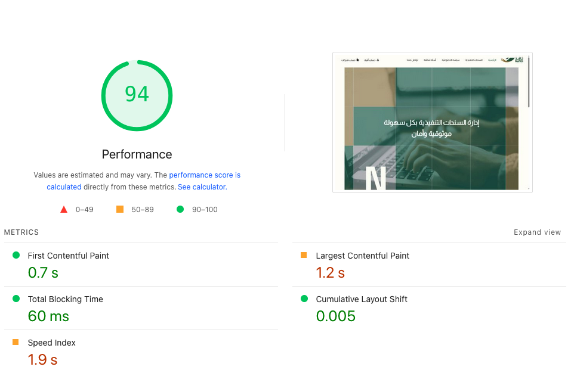

# Nafith Frontend Revamp

## Executive Overview

  Frontend Team

  2026

<!--
Welcome. This is a high-level overview of why we rebuilt our frontend platform and what it means for the business.
-->

---
transition: fade-out
---

# Agenda

<v-clicks>

1. Why did we rebuild?
2. What changed?
3. What does this mean for the business?
4. Where are we now?
5. What's next?

</v-clicks>

---
layout: section
---

# Why Did We Rebuild?

---

# The Problem

Our platform grew, but the foundation didn't keep up.

<v-clicks>

- **Slow page loads** — all resources loaded upfront, even when unused
- **Slow feature delivery** — adding one feature required changes across 5+ areas
- **Growing technical debt** — ~27,000 lines of tangled code with no clear structure

</v-clicks>

<v-click>

**Bottom line**: Every new feature took longer, cost more, and carried more risk than it should have.

</v-click>

<!--
The old system worked, but it was slowing us down. Every new feature meant working around accumulated problems. Bug fixes often introduced new bugs. This was unsustainable.
-->

---
layout: section
---

# What Changed?

---

# From Complexity to Clarity

### Before

<v-clicks at="1">

- **2 UI libraries** fighting each other
- **2 different** coding patterns
- **59 style files** with conflicts
- **1 massive file** for all navigation (1,800+ lines)
- All translations loaded on **every page**

</v-clicks>

### After

<v-clicks at="1">

- **1 unified** design system
- **1 consistent** coding pattern
- **Scoped styles** per feature — no conflicts
- **Modular navigation** — each feature manages its own
- Translations loaded **only when needed**

</v-clicks>

<!--
The theme is consolidation. Two libraries became one. Three patterns became one. One monolithic file was split into manageable modules.
-->

<v-click>

Adding a new feature = **adding one module**. No risk to existing functionality.

</v-click>

<!--
Think of it like LEGO blocks. Each module works independently. Adding or removing one doesn't break the others. This is what makes the new system scalable.
-->

---
layout: big-points
---

# What Does This Mean for the Business?

---
layout: fact
---

# ~4.5MB

of unnecessary code removed from every page load

  

    Old
    
  

  

  New
    
  

---
layout: fact
---

The performance gains are obvious

  

    Old
    
  

  

  New
    
  

---

# Business Impact

<v-clicks>

- **Faster page loads** — users only download what they need, when they need it

- **Fewer bugs reaching users** — errors are caught automatically before deployment

- **Faster feature delivery** — developers add features in one place, not five

- **Easier onboarding** — new developers can contribute faster with clear structure

- **Future-proof** — modern technology stack with long-term support

</v-clicks>

<!--
Each of these points maps to a real cost saving or quality improvement. Fewer bugs means less support overhead. Faster delivery means features reach users sooner. Consistent design means a more professional product.
-->

---
layout: section
---

# Where Are We Now?

---

# Migration Progress

### Completed

<v-clicks at="1">

- Core Platform & Shared Components
- Public Pages (Home, FAQ, Contact, Privacy)
- Authentication (IAM SSO, Company, OTP)
- Financial Details (packages, invoices, subscriptions)
- Employee Management (full CRUD + permissions)
- Callback History (Individual & B2B)
- Sanad Management (Individual)

</v-clicks>

### Remaining

<v-clicks at="8">

- Company Onboarding
- Sanad Management (B2B)
- Sanad Creation Wizards
- Sanad Approval Flows
- Portal Dashboard & Account Profile
- Company Integration & Settings
- Reports & Digital Signature
- UI/UX Polish

</v-clicks>

---
layout: big-points
---

# ~30%

of modules fully migrated

<v-click>

**10 of 28** modules complete — covering authentication, sanad management, employees, financials, and callbacks

</v-click>

<!--
We prioritized the most-used parts of the platform first. The modules that handle the most daily user traffic are already running on the new system.
-->

---
layout: section
---

# What's Next?

---

# Roadmap

<v-clicks>

- **Phase 1** (Ready For QA) — Core platform, auth, employees, financials, callback history

- **Phase 2** (In Progress) — Sanad creation & approval flows, Sanad management, Sanad Settlement, Account managament, Portal Dashboard and Digital signatures, 

- **Phase 3** (Upcoming) — Company onboarding, settings and integration, User profile and Reports

</v-clicks>

<v-click>

Each phase builds on the previous one. The hardest work — the foundation — is already done.

</v-click>

<!--
The foundation is complete. Every new module we migrate goes faster than the last because the patterns are established and the shared components are ready.
-->

---

# Summary

<v-clicks>

- **Why** — The old system was slowing us down and accumulating risk

- **What** — Complete rebuild on modern, modular, and maintainable technology

- **Impact** — Faster loads, fewer bugs, faster delivery, consistent experience

- **Progress** — ~30% complete, core is done

- **Next** — Sanad creation/approval flows, then onboarding and remaining modules

</v-clicks>

---
layout: center
class: text-center
---

# Thank You

Questions?

Nafith Frontend Team

<!--
Thank you. Happy to take any questions about the timeline, priorities, or business impact.
-->
